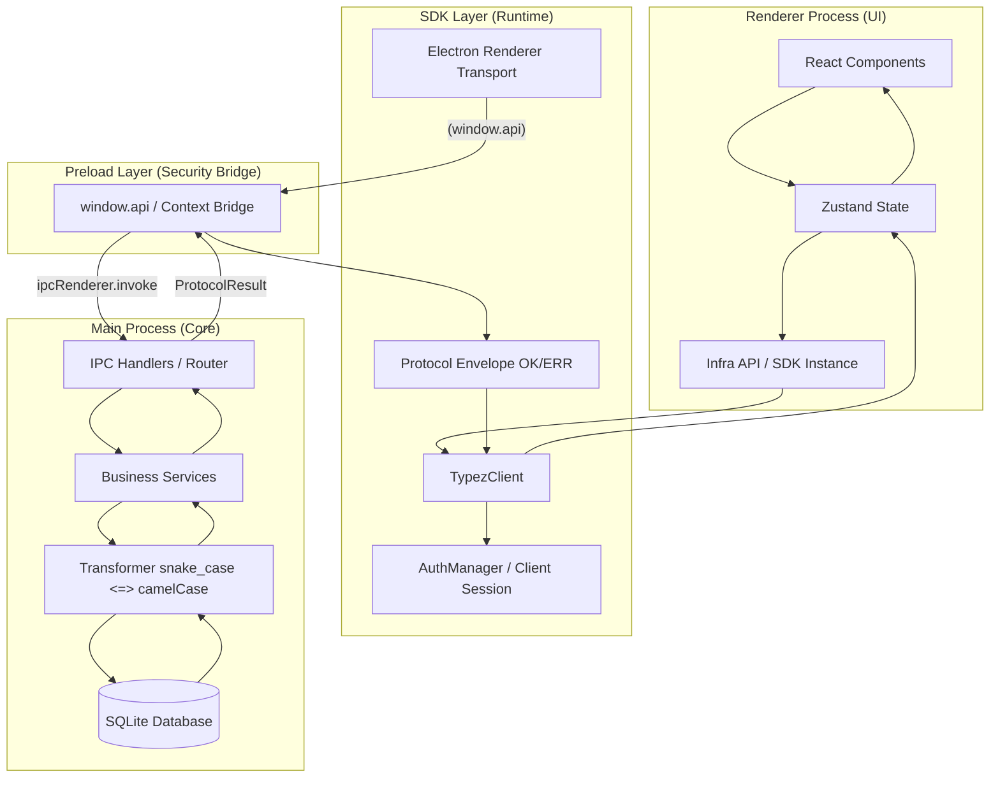

# Typez IM Application - Architecture Overview

## 📁 Project Structure

```
src/
├── main/                          # Electron 主进程 (业务核心)
│   ├── database/                  # SQLite 数据库服务与类型
│   ├── ipc/                       # IPC Handlers (调用控制层)
│   ├── services/                  # 业务实现 (Real/Mock 自动切换)
│   ├── mock/                      # Mock 实现与数据生成器
│   └── utils/                     # 窗口状态、转换工具等
│
├── preload/                       # Preload 脚本 (IPC 暴露与桥接)
│
├── sdk/                           # 独立 SDK 层 (核心领域与契约)
│   ├── auth/                      # 认证逻辑、Session 与异常定义
│   ├── core/                      # 核心 Transport、RPC 协议与 Kernel 抽象
│   ├── types/                     # 领域模型 (User/Chat) 与 IPC 契约定义
│   ├── domains/                   # 跨端业务领域逻辑 (Usecases/Models)
│   └── client.ts                  # TypezClient 顶层入口
│
├── renderer/src/                  # 渲染进程 (View 层)
│   ├── infra/                     # 基础设施 (实例化 SDK & API 封装)
│   ├── stores/                    # Zustand 全局状态
│   ├── pages/                     # 路由页面
│   ├── components/                # UI 组件
│   └── app/                       # 全局配置
│
└── shared/                        # 极薄共享层
    ├── constants/                 # 跨进程应用常量 (APP_NAME, DB_NAME)
    └── application/               # 环境无关的基础逻辑 (可选)
```

## 🏗️ Architecture Layers

### 1. SDK Layer (核心自洽层)

- **Location**: `src/sdk/`
- **地位**: 项目的“单一事实来源 (Single Source of Truth)”。它不仅包含 API 封装，还包含了领域模型定义和 IPC 通信契约。
- **独立性**: SDK 不依赖项目内部的 `main` 或 `renderer`，具备独立发布并被其他终端（如移动端、Web 端）复用的潜力。

### 2. Main Process (业务实现层)

- **职能**: 填充 SDK 定义的契约，负责持久化、系统级操作。
- **数据流**: 负责将数据库的 `snake_case` 数据形态转换为 SDK 定义的 `camelCase` 领域模型。

### 3. Renderer Process (极薄展示层)

- **职能**: UI 展示与简单交互状态。通过基础设施层对 SDK 进行实例化，并利用 React Query 管理服务端状态。

## 🔧 Technology Stack

| Category     | Technology      | Version | Purpose             |
| ------------ | --------------- | ------- | ------------------- |
| Desktop      | Electron        | 39.x    | 跨平台桌面容器      |
| Build        | Vite            | 7.x     | 极速构建与开发工具  |
| Framework    | React           | 19.x    | UI 渲染框架         |
| Language     | TypeScript      | 5.x     | 强类型开发支撑      |
| Styling      | Tailwind CSS    | 4.x     | 现代化 CSS 解决方案 |
| State        | Zustand         | 5.x     | UI 状态管理         |
| Server State | React Query     | 5.x     | 数据同步与缓存      |
| Router       | TanStack Router | 1.x     | 类型安全路由        |
| Animation    | Framer Motion   | 12.x    | 丝滑 UI 动效        |
| Database     | better-sqlite3  | 12.x    | 嵌入式高性能数据库  |

## 📊 Data Flow & Synchronization

### Request-Response Flow (IPC)



### Session Persistence Mechanism

为了保证跨页面刷新和应用重启后的登录状态一致性，项目实现了**双层持久化同步**：

1.  **Renderer 层**：使用 `zustand/middleware/persist` 将基本用户信息（User ID 等）存入 `localStorage` (`auth-storage`)。
2.  **SDK 层**：`AuthManager` 独立维护内存中的 Session，并在初始化时从 `localStorage` 回填，确保 SDK API 随时可用。
3.  **Main 层**：在 SQLite 数据库中维护 `app_state` 表（Key-Value），持久化存储 `current_user_id`。
4.  **同步逻辑**：应用启动时，渲染进程调用 `auth:me`。主进程会检查 `app_state` 尝试恢复会话。若匹配成功，则实现“无感自动登录”。

## 🎯 Key Design Principles

1.  **Type-First Development**: 所有接口通过 `src/sdk/contract/index.ts` 契约强制约束，实现“接口变动，编译报错”。
2.  **Decoupled SDK**: 渲染进程不直接调用 `window.api`，而是通过封装好的 SDK，确保业务逻辑在不同平台（Web/Electron）的移植性。
3.  **Envelope Protocol**: 采用 `ProtocolResult<T>` 统一包装所有响应，内建错误代码（ErrorCode）系统，区分“传输错误”、“业务逻辑错误”和“数据库异常”。
4.  **Snake-to-Camel Logic**: SQL 层坚持 `snake_case`（符合传统 DB 规范），业务层统一使用 `camelCase`。映射职责由主进程 `transformers.ts` 完成。
5.  **Multi-Session Safety**:
    - **Main**: 状态从数据库恢复，确保进程异常退出后可找回。
    - **Renderer**: `initialize` 方法带并发锁（Loading 状态），防止页面刷新时重复发起初始化请求。

---

**Last Updated**: 2025-12-24
**Status**: Aligned with Current Implementation (v1.0.0 Refactor)
